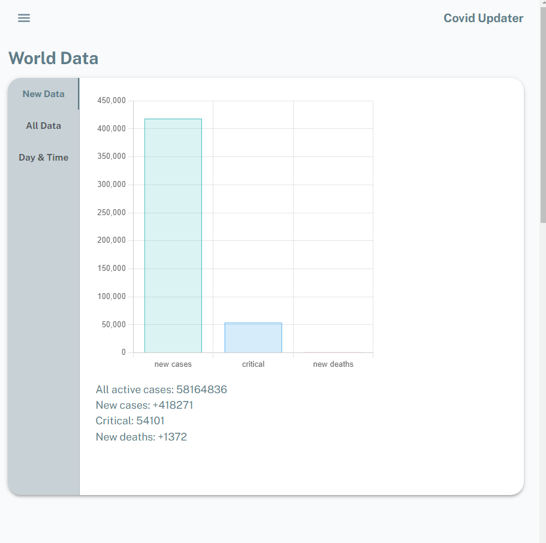
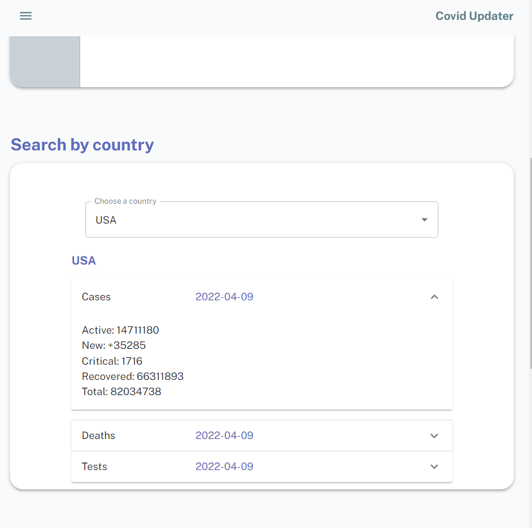
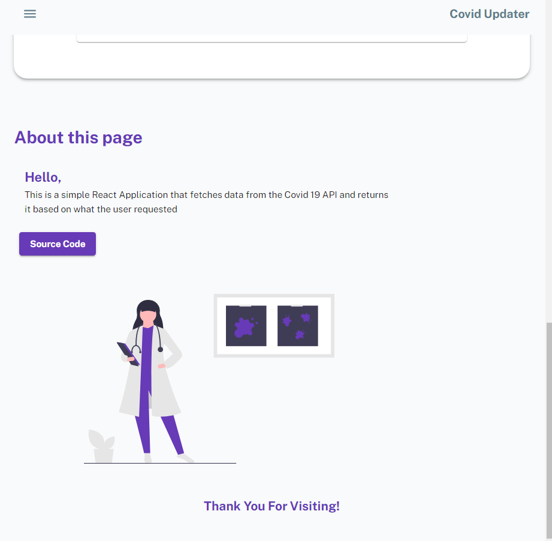

<br/>
<p align="center">
  <a href="https://github.com/ThatLukaszGuy/covid-updater">
    
  </a>

  <h3 align="center">Covid Updater</h3>

  <p align="center"> Check the latest available statistics presented in many formats with data from covid-19 API
    <br/>
    <br/>
    <a href="https://nodemagic.herokuapp.com/">View Demo</a>
    .
  </p>
</p>

 

## Table Of Contents

- [Table Of Contents](#table-of-contents)
- [About The Project](#about-the-project)
- [Built With](#built-with)
- [Getting Started](#getting-started)
  - [Prerequisites](#prerequisites)
  - [Installation](#installation)
- [License](#license)
- [Authors](#authors)

## About The Project



This Website allows users to access the newewst statistics provided by the Covid-19 API.
For the entire world the data gets dynamically visualized and is displayed in form of a bar chart. You can also search for specific countries and get all necessary information 

## Built With

<a href="https://developer.mozilla.org/en-US/docs/Web/JavaScript" target="_blank" rel="noreferrer">  </a> </a>  <a href="https://reactjs.org/" target="_blank" rel="noreferrer">  </a>  


## Getting Started


### Prerequisites

You will need a package manager (e.g: npm or yarn)

### Installation

1. Clone Repo

2. Install NPM packages

    ```sh
     npm i
     ```

3. Navigate to root dir and type     
    ```sh
     npm start
     ```
   

## License

Distributed under the ISC License. 

## Authors

* ThatLukaszGuy


